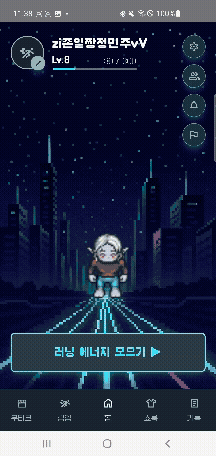

# 🏙️ RunningCity – 러닝 RPG 플랫폼

## 1. 서비스 소개

도심을 달리고, 경험치를 모으고, 캐릭터를 성장시키는 **러닝 RPG 플랫폼 – RunningCity**  
RunningCity는 워치와 모바일을 연동해 실제 달리기 데이터를 기반으로 게임처럼 즐기는 러닝 서비스이다.

단순한 기록 저장에 머무르지 않고,  
러닝을 통해 **레벨 업**, **아이템 수집**, **쇼룸 꾸미기**, **친구 경쟁**, **AI 리포트 분석**까지 가능하다.

RunningCity는 다음과 같은 핵심 경험을 제공한다.

- 워치 기반 실시간 GPS·심박·페이스 수집
- 달리기를 통한 경험치·재화 획득
- 상점/가챠 기반 캐릭터 꾸미기
- 잠입 미션으로 매일 다른 지역 러닝 플레이
- 쇼룸으로 캐릭터 자랑 및 친구 캐릭터 구경
- GPS 맵 기반 러닝 경로 + AI 분석 리포트 제공
- 일일/주간 퀘스트로 동기 부여

러닝을 하나의 게임 플레이처럼 만드는, 새로운 형태의 러닝 플랫폼이다.

---

## 2. 기능 소개 

### 1) 메인 화면 – 워치 연동하기
워치를 자동으로 감지하고 연동하여 실시간 GPS·심박 데이터를 앱으로 전달한다.  
UI에서 연결 상태를 직관적으로 확인할 수 있다.

---

### 2) 메인 화면 – "달리기 하기" → 러닝 화면 진입
버튼 클릭 즉시 실시간 러닝 모드로 진입.  
거리·페이스·심박·시간 등 데이터를 확인하며 달릴 수 있다.

---

### 3) 상점 – 아이템 가챠/구매
러닝으로 얻는 모든 재화로 가챠를 돌릴 수 있다.  
가챠/상점에서 획득한 장비 아이템으로 캐릭터를 꾸밀 수 있다.

---

### 4) 잠입 모드 – 공공데이터 기반 러닝 미션
매일 다른 지역의 "활성화된 기지"에 잠입해 달리기를 수행하는 모드.  
달리기 좋은 지역(공공데이터 기반)에서 달리면 추가 경험치/재화를 획득할 수 있다.

---

### 5) 내 사무실 – 캐릭터 꾸미기 & 자랑 공간
가챠·상점에서 획득한 아이템으로 캐릭터를 꾸미는 개인 공간.  
다른 사용자에게 자신의 캐릭터를 자랑할 수 있다.

---

### 6) 친구 쇼룸 – 친구/랜덤 유저 캐릭터 구경
친구가 꾸민 캐릭터 확인 가능  
친구가 아닌 유저는 랜덤으로 노출  
내 캐릭터 또한 쇼룸에 전시 가능

---

### 7) 기록 – 달리기 기록 & AI 러닝 리포트
월별 달력에서 달린 날짜를 한눈에 확인  
러닝 기록 리스트 확인  
상세에서 지도 기반 GPS 경로(폴리라인) 시각화  
AI 리포트 생성 기능으로 내 러닝 패턴 분석 제공

---

### 그 외 기능 소개

- 온보딩에서 워치 연동 및 심박 체크 가능  
- 일일 / 주간 퀘스트로 재화·경험치 획득  
- 친구 탭에서 친구 목록, 랭킹, 요청/수락 기능 제공  
- 알림 탭에서 친구 요청 등을 확인 가능  

---

## 3. 서비스 아키텍처 & 기술 스택

### 🔧 기술 스택

| 분류 | 기술 스택 |
|------|-----------|
| **Frontend (Mobile WebView)** |  |
| **Android / Wear OS** |  |
| **Backend** |  |
| **DB / Infra** |  |
| **배포 / DevOps** |  |
| **Frontend Monitoring** | Firebase |
| **협업** |  |

---

## 4. 팀원 소개
| 문지후 | 강설민 | 유아름 | 이유리 | 정민주 | 김준서 |
|:---:|:---:|:---:|:---:|:---:|:---:|
|  |  | |  |  |  |
| **Frontend  Backend** | **Frontend  Backend** | **Infra  Frontend / Backend** | **Frontend  Backend** | **Frontend  Backend** | **Frontend  Backend** |
